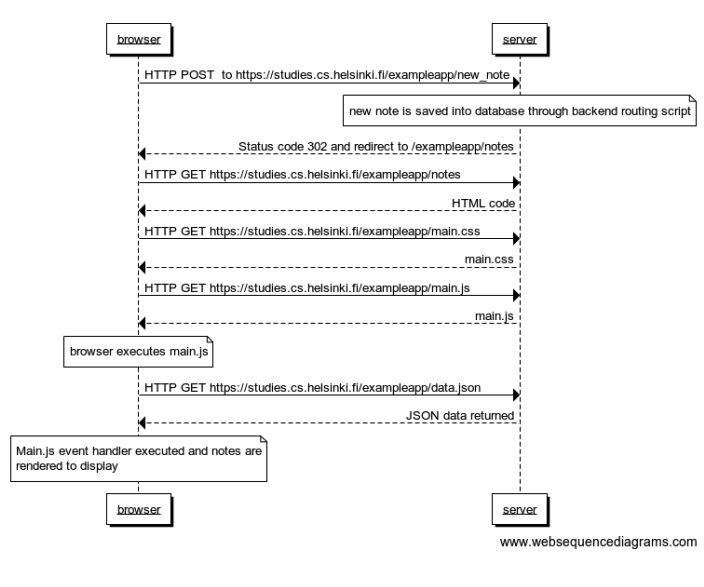
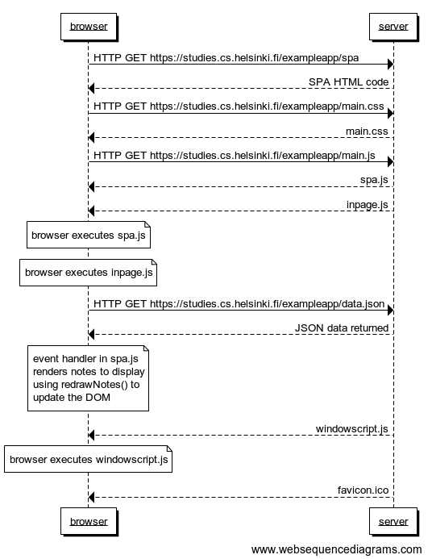
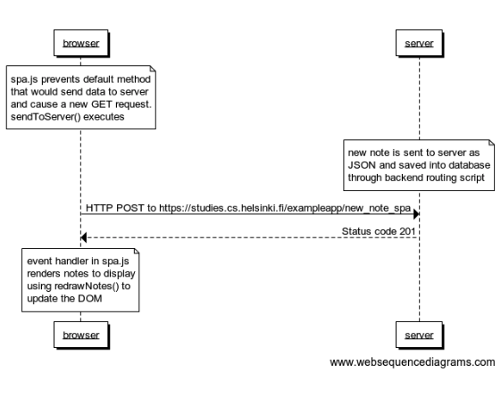

# Part 0 Solutions : [Fundamentals of Web Apps](https://fullstackopen.com/en/part0/fundamentals_of_web_apps "Fundamentals of Web Apps")
## Course Material
https://fullstackopen.com/en/part0
## Exercise Description
https://fullstackopen.com/en/part0/fundamentals_of_web_apps#exercises-0-1-0-6
## Solutions
### 0.4: new note

### 0.5: single page app

### 0.6: new note (SPA)

